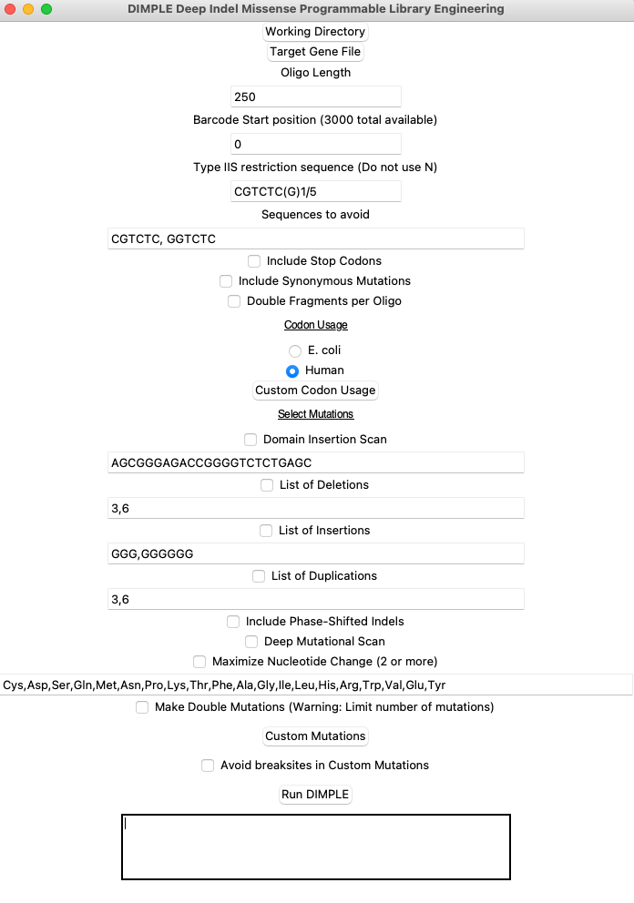

# DIMPLE: Deep Indel Missense Programmable Library Engineering

## Protein domain insertion via programmed oligo libraries

A Python script for generating oligo libraries and PCR primers for Deep Mutational Scanning library generation incorporating indel variation.
Note: This is a modified version of DIMPLE that introduces phase-variation to deletions and internal tandem duplications.

Take a look at the protocol on [protocols.io](https://www.protocols.io/view/dimple-library-generation-and-assembly-protocol-rm7vzy7k8lx1) for more information on generating and assembling libraries as well.

The original repository is [here](https://github.com/coywil26/DIMPLE/tree/master).

# Installation

## Simple method

This version of DIMPLE does not yet have a Google Colab notebook. 

## Local install

### Install requirements

#### Using Conda

Use the supplied Conda environment file to install and manage dependencies. This will create a new environment called `dimple_env`.

Use the following commands to install and load the environment:

```{bash}
conda env create -f dimple_env.yml
conda activate dimple_env
```

#### Manually install requirements

DIMPLE requires the following packages:

- python
- numpy
- biopython
- tkinter (only required for GUI version)

Install with your preferred package manager (e.g. pip).

Note: DIMPLE has been tested on Python version 3.12. Biopython is currently incompatible with Python 3.13 in some cases, and we recommend using Python 3.12 for now.

# Inputs

## Target gene file

Targeted genes should be supplied in [FASTA format](https://en.wikipedia.org/wiki/FASTA_format). To allow DIMPLE to check for nonspecific amplification, include the entire plasmid sequence of the library generation construct in the file.

The ORF can be specified in the fasta header for each target gene. If desired, the header should include the start and end positions of the gene in the plasmid, as follows:

```{text}
>gene1 start:10 end:100
ATGTT...
```

The start position should be the first base of the first codon, and the end position should be the last base of the last codon. Otherwise specify the ORF in the command line.

# Running DIMPLE

## Local version

We have supplied two methods to run DIMPLE: a command-line version, and a GUI.
Both offer the same functionality, but the GUI is more user-friendly.

### GUI usage

Start the GUI with the following command:

```{bash}
python run_dimple_gui.py
```



The following are required:

- Target gene file (see below for format requirements)
- One or more of the mutations to make to the target gene

Supply options, then generate library by pressing 'Run DIMPLE' button.

### Command-line usage

See a description of options for command-line version:

```{bash}
python run_dimple.py -h
```

Full list of options:

```{text}
options:
  -h, --help            show this help message and exit
  -wDir WDIR            Working directory for fasta files and output folder
  -geneFile GENEFILE    Input all gene sequences including backbone in a fasta format. Place all in one fasta file. Name description can include start and end points (>gene1 start:1
                        end:2)
  -handle HANDLE        Genetic handle for domain insertion. This is important for defining the linker. Currently uses BsaI (4 base overhang), but this can be swapped for SapI (3
                        base overhang).
  -dis DIS              use the handle to insert domains at every position in POI
  -matchSequences       Find similar sequences between genes to avoid printing the same oligos multiple times. Default: No matching
  -oligoLen OLIGOLEN    Synthesized oligo length
  -fragmentLen FRAGMENTLEN
                        Maximum length of gene fragment
  -overlap OVERLAP      Enter number of bases to extend each fragment for overlap. This will help with insertions close to fragment boundary
  -DMS                  Choose if you will run deep deep mutation scan
  -custom_mutations CUSTOM_MUTATIONS
                        Path to file that includes custom mutations with the format position:AA
  -usage USAGE          Default is "human". Or select "ecoli. Or change code"
  -insertions INSERTIONS [INSERTIONS ...]
                        Enter a list of insertions (nucleotides) to make at every position. Note, you should enter multiples of 3 nucleotides to maintain reading frame
  -duplications DUPLICATIONS [DUPLICATIONS ...]
                        Enter a list of duplications (number of nucleotides). Note you should enter multiples of 3 to maintain reading frame.
  -deletions DELETIONS [DELETIONS ...]
                        Enter a list of deletions (number of nucleotides) to symmetrically delete (it will make deletions in multiples of 2x). Note you should enter multiples of 3 to
                        maintain reading frame
  -include_substitutions INCLUDE_SUBSTITUTIONS
                        If you are running DMS but only want to insert or delete AA
  -barcode_start BARCODE_START
                        To run DIMPLE multiple times, you will need to avoid using the same barcodes. This allows you to start at a different barcode.
  -restriction_sequence RESTRICTION_SEQUENCE
                        Recommended using BsmBI - CGTCTC(G)1/5 or BsaI - GGTCTC(G)1/5. Do not use N
  -avoid_sequence AVOID_SEQUENCE [AVOID_SEQUENCE ...]
                        Avoid these sequences in the backbone - BsaI and BsmBI. For multiple sequnces use a space between inputs. Example -avoid_sequence CGTCTC GGTCTC
  -include_stop_codons  Include stop codons in the list of scanning mutations.
  -include_synonymous   Include synonymous codons in the list of scanning mutations.
  -make_double          Make each combination of mutations within a fragment
  -maximize_nucleotide_change
                        Maximize the number of nucleotide changes in each codon for easier detection in NGS
  -phaseshift           Generate phase-variable deletions and duplications (but not insertions)
```

# Example output

Example output files are located in the `examples` directory.


# Citing DIMPLE

If you found DIMPLE useful, feel free to cite the publication describing it:

- Preprint: [Macdonald et al., 2022](https://doi.org/10.1101/2022.07.26.501589)
- Published: [Macdonald et al., 2023](https://doi.org/10.1186/s13059-023-02880-6)

# License

This code is licensed under the terms of the MIT license: [License](License.txt)

# Contributing

Contributions and feedback are welcome. Please submit an issue or pull request.
